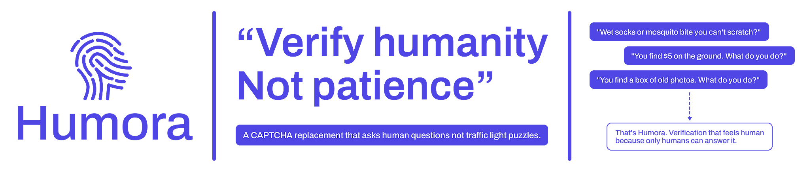

<div align="center">



[](LICENSE)
[](https://react.dev)
[](https://vitejs.dev)
[](https://tailwindcss.com)
[](https://www.framer.com/motion)

</div>

---

## What Is Humora?

Traditional CAPTCHA is broken. It frustrates real users, tanks conversion rates, and increasingly fails to stop modern bots. **Humora is a drop-in replacement** — a lightweight, embeddable widget that verifies humanity through emotionally intelligent, personality-driven micro-questions.

Instead of:

> _"Select all images containing traffic lights"_ 😤

Humora asks:

> _"Someone waves at you but meant someone behind you. You..."_ 😅

Five questions. Thirty seconds. Zero frustration. Genuine human signal.

---

## How It Works

Humora doesn't verify humanity through correct answers — it verifies through **human behavioral patterns**:

```
User hits your form
        ↓
Humora widget appears
        ↓
5 questions · ~30 seconds · feels like a personality quiz
        ↓
3 signals captured simultaneously:
  ├── Answer patterns    (what humans actually pick)
  ├── Response timing    (how fast humans naturally react)
  └── Interaction entropy (mouse/touch movement organic vs. robotic)
        ↓
Scoring engine aggregates all signals → confidence score
        ↓
Score ≥ 50/70 → JWT token issued → form proceeds
        ↓
(Optional) Your backend verifies token with Humora API
```

---

## The Question System

Humora draws from a bank of **30 handcrafted questions** across 5 categories. Every session picks **1 question per category** at random — giving **7,776 unique session combinations** that are nearly impossible to train a bot against.

| Category                         | Example Question                                                   | Why It Works                                   |
| -------------------------------- | ------------------------------------------------------------------ | ---------------------------------------------- |
| 🧠 **Sensory & Visceral**        | _"You open the fridge and something smells off. You..."_           | Bots can't simulate sensory memory             |
| 😬 **Social Awkwardness**        | _"You said 'you too' when the waiter said enjoy your meal..."_     | Requires lived social experience               |
| 🤔 **Emotional Micro-decisions** | _"You have 3% battery and no charger. You..."_                     | Irrational choices are uniquely human          |
| 🌅 **Nostalgia & Memory**        | _"The most dangerous playground equipment from your childhood..."_ | Shared human experience AIs never had          |
| 😂 **Humor & Absurdity**         | _"Your villain origin story would be..."_                          | Humor recognition is the hardest thing to fake |

> **No option is wrong.** Every choice is valid. Scoring is entirely behavioral — not correctness-based.

---

## Scoring Engine

```
Signal              Max Points    Weight    Method
─────────────────────────────────────────────────────
Answer Score           50 pts     ~71%     humanScore per option × 5 questions
Timing Bonus           10 pts     ~14%     2 pts per question in human zone
Behavior Bonus         10 pts     ~14%     Mouse/touch entropy analysis
─────────────────────────────────────────────────────
Total Maximum          70 pts     100%

Verdict Thresholds:
  ≥ 50  →  ✅ PASS         JWT token issued
  35–49 →  ⚠️ BORDERLINE   1 bonus question shown
  < 35  →  ❌ FAIL         Verification denied
```

### Timing Intelligence (per question)

```
< 300ms      → Bot flag     (0 pts)  Too instant — no human reads that fast
300–800ms    → Suspicious   (1 pt)   Fast but possible
800–4,000ms  → Human zone   (2 pts)  Natural gut-reaction speed ✅
4,000–8,000ms → Thoughtful  (1 pt)   Reading carefully — still human
> 8,000ms    → Distracted   (0 pts)  Stepped away
```

---

## Features

- **🧠 Behaviorally intelligent** — Scores timing, mouse entropy, and answer patterns simultaneously
- **🎲 7,776 unique sessions** — 6 questions per category, 1 drawn per session — never the same twice
- **⚡ ~30 seconds** — Faster than finding traffic lights in blurry images
- **😊 Zero frustration** — Feels like a personality quiz, not a security gate
- **🔒 JWT secured** — Signed tokens with 5-minute expiry, replay-attack resistant
- **📱 Mobile-first** — Full touch behavior tracking, responsive layout
- **🧩 Drop-in embed** — Same integration pattern as reCAPTCHA
- **🔏 Privacy-safe** — No PII collected, no tracking, no data storage
- **🎨 SaaS-grade UI** — Archivo font, white + indigo theme, Framer Motion animations
- **🌐 postMessage API** — Secure cross-origin communication with host page

---

## Tech Stack

| Layer         | Technology                           |
| ------------- | ------------------------------------ |
| Framework     | React 18 + Vite 5                    |
| Styling       | Tailwind CSS                         |
| Animations    | Framer Motion                        |
| Font          | Archivo (Google Fonts)               |
| Token Signing | jose (JWT / HS256)                   |
| Question Bank | Static JSON (30 questions)           |
| Build         | Vite library mode → single JS bundle |

---

## Project Structure

```
humora/
├── public/
│   ├── index.html                   # Demo / test page
│   └── widget.html                  # iframe shell for embed
├── src/
│   ├── components/
│   │   ├── WelcomeScreen.jsx        # Screen 1 — intro + begin CTA
│   │   ├── QuestionScreen.jsx       # Screen 2 — question + options (×5)
│   │   ├── ScoringScreen.jsx        # Screen 3 — 1.8s analysis animation
│   │   ├── PassScreen.jsx           # Screen 4a — verified human + personality line
│   │   ├── FailScreen.jsx           # Screen 4b — fail + retry
│   │   ├── ProgressBar.jsx          # Top progress indicator (1 of 5)
│   │   └── OptionCard.jsx           # Individual answer card component
│   ├── engine/
│   │   ├── QuestionEngine.js        # Random selector — 1 per category
│   │   ├── InteractionTracker.js    # Timing + mouse + touch signal capture
│   │   └── ScoringEngine.js         # Signal aggregation + verdict logic
│   ├── data/
│   │   └── questions.json           # All 30 questions with humanScore values
│   ├── utils/
│   │   ├── tokenGenerator.js        # JWT signing on pass
│   │   └── scoringHelpers.js        # Pure utility functions
│   ├── embed/
│   │   └── humora-api.js            # window.humora public API (reCAPTCHA-like)
│   ├── Widget.jsx                   # Root component + state machine
│   └── main.jsx                     # Entry point
├── humora-server/                   # Optional verification backend
│   ├── index.js                     # Express server
│   └── routes/
│       ├── verify.js                # POST /api/verify
│       └── register.js             # POST /api/register
├── package.json
├── tailwind.config.js
└── vite.config.js
```

---

## Widget State Machine

```
┌─────────────┐
│   WELCOME   │ ◄──────────────────────────────────┐
└──────┬──────┘                                     │
       │ click "Begin Check"                        │ click "Try Again"
       ▼                                            │
┌─────────────┐                             ┌───────┴─────┐
│  QUESTION   │ ──── after question 5 ────► │   SCORING   │
│  (0 → 4)   │                             │  (1.8 secs) │
└─────────────┘                             └──────┬──────┘
                                                   │
                              ┌────────────────────┼──────────────────┐
                              ▼                    ▼                  ▼
                         ┌─────────┐        ┌──────────┐       ┌──────────┐
                         │  PASS   │        │BORDERLINE│       │   FAIL   │
                         │  ✅     │        │  ⚠️      │       │   ❌     │
                         └─────────┘        └────┬─────┘       └──────────┘
                                                 │
                                          1 bonus question
                                                 │
                                    ┌────────────┴────────────┐
                                    ▼                         ▼
                               ┌─────────┐             ┌──────────┐
                               │  PASS   │             │   FAIL   │
                               └─────────┘             └──────────┘
```

---

## Quick Start

### Prerequisites

- Node.js 18+ and npm
- A modern browser

### Installation

```bash
# Clone the repository
git clone https://github.com/yourusername/humora.git
cd humora

# Install dependencies
npm install

# Start development server
npm run dev
```

Open [http://localhost:5173](http://localhost:5173) to see the widget running.

### Build for Production

```bash
npm run build
```

This outputs `dist/humora.min.js` — a single embeddable JS file, ready for any website.

---

## Integration

Humora integrates exactly like Google reCAPTCHA. If you've used reCAPTCHA before, you already know how to use Humora.

### Step 1 — Add the Script Tag

```html
<script src="https://widget.humora.io/humora.min.js" async defer></script>
```

### Step 2 — Add the Widget to Your Form

```html
<form id="signup-form">
  <input type="email" placeholder="Email address" name="email" />
  <input type="password" placeholder="Password" name="password" />

  <!-- Drop this anywhere in your form -->
  <div class="humora-widget" data-sitekey="YOUR_SITE_KEY"></div>

  <button type="submit">Create Account</button>
</form>
```

### Step 3 — Handle Verification

```javascript
humora.ready(function () {
  humora.render("humora-container", {
    sitekey: "YOUR_SITE_KEY",

    // Called when user passes — token is your verification proof
    callback: function (token) {
      document.getElementById("humora-token").value = token;
      document.getElementById("signup-form").submit();
    },

    // Called if token expires (5 min limit)
    expiredCallback: function () {
      console.log("Verification expired — please verify again");
    },
  });
});
```

### Step 4 — Verify Server-Side (Recommended)

```javascript
// Node.js / Express example
app.post("/signup", async (req, res) => {
  const { humanToken, email, password } = req.body;

  // Verify the token with Humora API
  const result = await fetch("https://api.humora.io/api/verify", {
    method: "POST",
    headers: { "Content-Type": "application/json" },
    body: JSON.stringify({
      token: humanToken,
      sitekey: process.env.HUMORA_SITE_KEY,
    }),
  }).then((r) => r.json());

  if (!result.success) {
    return res.status(400).json({ error: "Human verification failed" });
  }

  // Proceed with account creation
  await createUser({ email, password });
  res.json({ success: true });
});
```

### postMessage API

For iframe-based integrations, Humora communicates results via `postMessage`:

```javascript
window.addEventListener("message", (event) => {
  if (event.data.source !== "humora") return;

  if (event.data.verified) {
    console.log("Passed!", {
      token: event.data.token, // JWT — send to your backend
      score: event.data.score, // 0–70
      sessionId: event.data.sessionId,
    });
  } else {
    console.log("Failed", { score: event.data.score });
  }
});
```

---

## API Reference

### `humora.render(containerId, config)`

Mounts the widget into a DOM element.

| Parameter                | Type       | Description                   |
| ------------------------ | ---------- | ----------------------------- |
| `containerId`            | `string`   | ID of the container element   |
| `config.sitekey`         | `string`   | Your registered site key      |
| `config.callback`        | `function` | Called with JWT token on pass |
| `config.expiredCallback` | `function` | Called when token expires     |

### `humora.getResponse(widgetId?)`

Returns the current JWT token string, or empty string if not yet verified.

### `humora.reset(widgetId?)`

Resets the widget back to the welcome screen.

### `humora.ready(callback)`

Queues a callback to run when Humora is fully loaded — safe to call before the script tag executes.

---

## Verification API

Base URL: `https://api.humora.io`

### `POST /api/verify`

Verify a token server-side.

**Request:**

```json
{
  "token": "eyJhbGciOiJIUzI1NiJ9...",
  "sitekey": "sk_live_abc123"
}
```

**Response (success):**

```json
{
  "success": true,
  "score": 58,
  "verdict": "pass",
  "timestamp": "2026-04-12T10:23:45Z"
}
```

**Response (failure):**

```json
{
  "success": false,
  "error": "invalid-token",
  "errorCodes": ["invalid-token"]
}
```

**Error Codes:**

| Code              | Meaning                                        |
| ----------------- | ---------------------------------------------- |
| `invalid-token`   | Token is malformed or signature mismatch       |
| `expired-token`   | Token is older than 5 minutes                  |
| `duplicate-token` | Token has already been used (replay attack)    |
| `invalid-sitekey` | Sitekey not registered or doesn't match domain |

### `POST /api/register`

Register a new site to get a sitekey.

**Request:**

```json
{
  "domain": "yourwebsite.com",
  "email": "you@yourwebsite.com"
}
```

**Response:**

```json
{
  "sitekey": "sk_live_x9k2mf3p",
  "domain": "yourwebsite.com"
}
```

---

## Running the Backend Server

```bash
cd humora-server

# Install dependencies
npm install

# Set environment variables
cp .env.example .env
# Edit .env with your JWT_SECRET

# Start the server
node index.js

# Server runs on http://localhost:3001
```

### Environment Variables

```env
PORT=3001
JWT_SECRET=your-production-secret-here-change-this
NODE_ENV=production
```

---

## Security Design

| Risk                               | Mitigation                                              |
| ---------------------------------- | ------------------------------------------------------- |
| Bot submits max score directly     | Token is signed server-side — score never self-reported |
| Replay attacks                     | JWT has 5-minute expiry + session ID per use            |
| AI trained on question bank        | 7,776 session combinations rotate constantly            |
| Inspect element score manipulation | Scores computed in JS memory — never stored in DOM      |
| Timing manipulation                | Server-side timestamp validation on verify              |
| Domain spoofing                    | Sitekey locked to registered domain on API verify       |
| Rate abuse                         | Express rate limiting: 100 requests / 15 minutes        |

---

## Personality Results

On passing, Humora shows a fun personality line — one of six, picked randomly:

```
"Chaotically empathetic. Definitely not a bot."
"Gloriously irrational. Verified human."
"Delightfully overthinking it. As expected."
"Suspiciously relatable. In a good way."
"Emotionally complex. Bots wish they were you."
"Beautifully unpredictable. That's very human."
```

---

## Design System

| Token         | Value     | Usage                            |
| ------------- | --------- | -------------------------------- |
| Primary       | `#4F46E5` | Buttons, active states, progress |
| Primary Hover | `#4338CA` | Button hover state               |
| Indigo Light  | `#EEF2FF` | Option hover background          |
| Background    | `#F5F5F7` | Page background                  |
| Card          | `#FFFFFF` | Widget card                      |
| Heading       | `#0F0F0F` | Question text                    |
| Body          | `#374151` | Option text                      |
| Muted         | `#9CA3AF` | Labels, meta text                |
| Success       | `#10B981` | Pass state                       |
| Error         | `#EF4444` | Fail state                       |
| Font          | Archivo   | All text — all weights           |

---

## Roadmap

### MVP (Current)

- [x] 30 question bank across 5 categories
- [x] 5 question random session (1 per category)
- [x] Multi-signal scoring engine
- [x] All 5 widget screens with animations
- [x] JWT token generation
- [x] postMessage API
- [x] Optional Express verification server

### V2 — Embed & Scale

- [ ] npm package (`npm install humora`)
- [ ] Question bank expansion (100+ questions)
- [ ] Framework SDKs (Vue, Angular, Svelte)
- [ ] Sitekey registration portal
- [ ] Usage analytics dashboard
- [ ] CDN distribution

### V3 — Intelligence

- [ ] ML-based scoring (replace heuristic model)
- [ ] Adaptive difficulty (harder questions for suspicious sessions)
- [ ] Custom question sets (enterprise tier)
- [ ] Accessibility mode (audio questions)
- [ ] Multi-language support

---

## Contributing

Contributions are welcome — especially new questions for the bank.

### Adding New Questions

1. Fork the repo
2. Open `src/data/questions.json`
3. Add your question following the schema:

```json
{
  "id": "q_031",
  "category": "humor_absurdity",
  "question": "Your question here — no objectively correct answer",
  "options": [
    { "id": "a", "text": "Option that feels deeply human", "humanScore": 10 },
    { "id": "b", "text": "Another relatable choice", "humanScore": 9 },
    { "id": "c", "text": "Neutral option", "humanScore": 6 },
    { "id": "d", "text": "What a robot might pick", "humanScore": 3 }
  ],
  "expectedTimingMs": { "min": 800, "max": 6000 }
}
```

4. Questions must pass this checklist:

   - [ ] No objectively correct answer exists
   - [ ] At least one option is funny or irrational (score 9–10)
   - [ ] A bot picking the "safest" answer gets a low score
   - [ ] The question triggers a genuine gut reaction
   - [ ] It's relatable to most humans globally

5. Open a pull request with the label `new-question`

### Development Setup

```bash
git clone https://github.com/yourusername/humora.git
cd humora
npm install
npm run dev
```

---

## Comparison to reCAPTCHA

| Feature                   | reCAPTCHA v2    | reCAPTCHA v3             | **Humora**           |
| ------------------------- | --------------- | ------------------------ | -------------------- |
| User experience           | Frustrating     | Invisible (scores in bg) | **Engaging**         |
| Time to complete          | 30s–3min        | Instant                  | **~30 seconds**      |
| Success rate (real users) | ~60–70%         | ~90%+                    | **~90%+**            |
| Requires Google account   | Yes (for setup) | Yes                      | **No**               |
| Data sent to third party  | Google          | Google                   | **None**             |
| Open source               | No              | No                       | **Yes**              |
| Self-hostable             | No              | No                       | **Yes**              |
| Custom questions          | No              | No                       | **Yes (enterprise)** |
| Mobile experience         | Poor            | Good                     | **Excellent**        |

---

## License

MIT License — see [LICENSE](LICENSE) for details.

You are free to use, modify, and distribute Humora in personal and commercial projects.

---

## Acknowledgments

Built with:

- [React](https://react.dev) — UI framework
- [Vite](https://vitejs.dev) — Build tool
- [Tailwind CSS](https://tailwindcss.com) — Styling
- [Framer Motion](https://www.framer.com/motion) — Animations
- [jose](https://github.com/panva/jose) — JWT signing
- [Archivo](https://fonts.google.com/specimen/Archivo) — Typography

---

<div align="center">

<br />

**Humora** — Built with the belief that security doesn't have to be hostile.

_If you found this useful, give it a ⭐ — it helps others find the project._

<br />

[**Live Demo**](soon) · [**Report Bug**](issues) · [**Twitter**](https://twitter.com/dwakshar)

<br />

</div>
